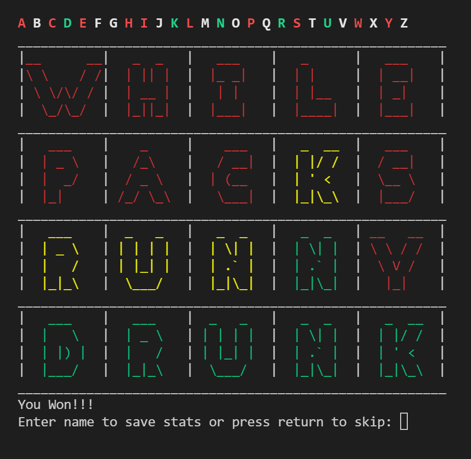
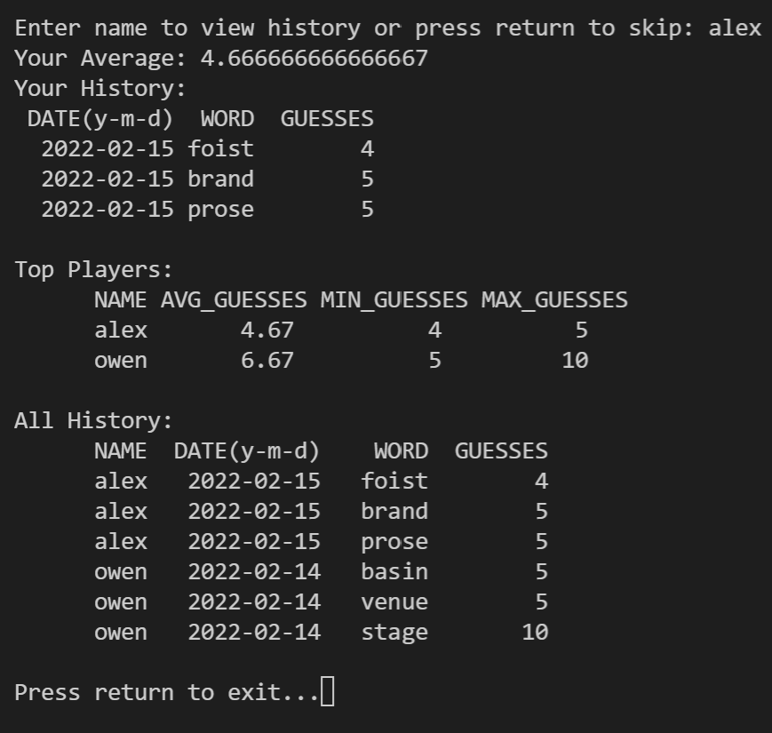

# pyordle
A simple command line wordle clone  
Saves scores to a SQL database and displays leaderboards and game history.  

See releases for .exe  

| Game      | Game History/Leaderboard |
| ----------- | ----------- |
|   |        |

